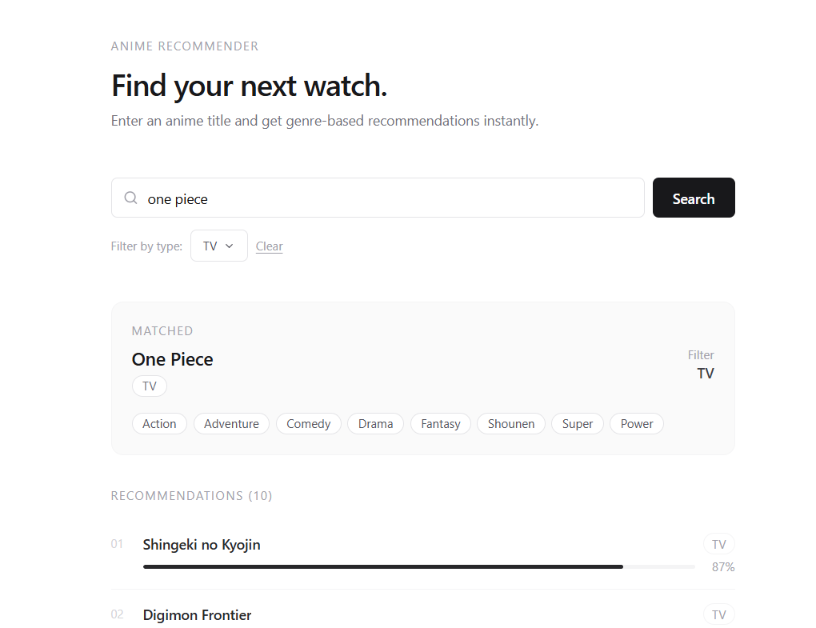

# 🎌 Anime Recommendation


This project recommends anime titles using **fuzzy search** and **cosine similarity** based on genres. It has two parts:

- **`backend/`** — a Node.js + Express API that reads a Kaggle dataset (`anime.csv`), performs fuzzy title matching and genre-based cosine similarity, and returns recommendations.
- **`frontend/`** — a Vite + React app that lets you search for an anime and view its recommendations.



---

## 🧱 Project Structure

```bash
anime-recommend-cosine/
├── backend/
│ ├── anime.csv
│ ├── server.js
│ ├── package.json
│ └── ...other backend files
│
├── frontend/
│ ├── src/
│ ├── index.html
│ └── package.json
│
├── LICENSE
└── README.md
```

---

## 🚀 Current Features

- Loads an anime dataset from a CSV file
- Cleans and normalizes genre and title data
- Uses **Fuse.js** for fuzzy text search
- Uses **cosine similarity** for genre-based recommendations
- REST API endpoint: `/api/recommendations?anime=<title>&type=<optional>`
- React frontend to search titles and browse ranked recommendations

## ⚙️ Installation & Setup

### 1️⃣ Clone the repository

```bash
git clone https://github.com/username/anime-recommend-cosine.git
cd anime-recommend-cosine
```

### 2️⃣ Run the backend

```bash
cd backend
npm install
node server.js
```

The backend starts on `http://localhost:4000`.

### 3️⃣ Run the frontend

In a separate terminal:

```bash
cd frontend
npm install
npm run dev
```

The frontend starts on `http://localhost:5173` (the backend only allows CORS requests from this origin).

## 📦 Dataset

The backend loads anime details from a Kaggle dataset (`anime.csv`).
Make sure the file is located inside the `backend/` folder.

### Expected Columns:

```bash
title, synopsis, genres, episodes, score, characters
```

## 🧭 Roadmap

**✅ Current**
- Fuzzy search + cosine similarity recommendations
- CSV dataset loading
- Express API route `/api/recommendations`
- React frontend for search and results

**🛠️ Planned**
- Add modular route structure
- Implement caching (Redis or in-memory)
- Add Docker support for easier deployment
- Integrate AI-based embedding similarity
- Add proper documentation and testing
